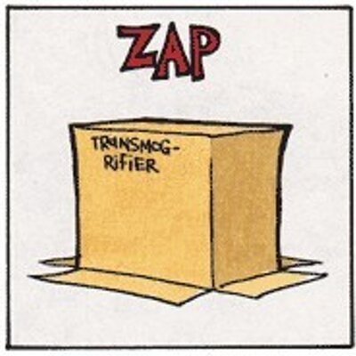

# RVTransmogrifier 
[](https://calvinandhobbes.fandom.com/wiki/Transmogrifier)

This package works with the [RVSurveyData package](https://github.com/PopulationEcologyDivision/RVSurveyData) to facilitate querying that data, and also to reformat that data as needed by different partners.

## Installation
```{r}
devtools::install_github("PopulationEcologyDivision/RVTransmogrifier")
```

## Querying data 
This package pulls data from the [RVSurveyData package](https://github.com/PopulationEcologyDivision/RVSurveyData) into a list, and can cascade user-imposed filters performed on a single data object to all of the other related data objects.  Anyone having used the [Mar.datawrangling package](https://github.com/Maritimes/Mar.datawrangling) will find this process familiar.  

For example, if we only want the cod data for the 2016 Summer survey, we could do:
```{r}
#load the package
library(RVTransmogrifier)

#load the data into an object
data<-loadRVData()

#filter the object as desired
#filtering by year and season 
data$GSMISSIONS <- data$GSMISSIONS[data$GSMISSIONS$YEAR==2016 &
                                   data$GSMISSIONS$SEASON == "SUMMER",]
                                   
#filtering by survey type
data$GSXTYPE    <- data$GSXTYPE[data$GSXTYPE$XTYPE==1,]

#filtering for a single species (10 = cod/Gadus morhua)
data$GSSPECIES  <- data$GSSPECIES$CODE[data$GSSPECIES$CODE == 10,]

#cascade the filters above to all of the data
data            <- filternator(data, keep_nullsets = T)
```
At this point, our `data` object will only hold information directly relevant to the filters we applied.  The various tables will only hold records for cod - there will be no data from other years.  Tables that exist but were not explicitly filtered will also be filtered - there will be no gear information other than gear that was used in the summer of 2016 and caught cod, and the table that holds length, weight and age information for specific fish (i.e. GSDET) will be similarly limited to only the records for cod that were caught in the summer of 2016.    Because `keep_nullsets=TRUE`, we WILL get all of the locations where fishing occurred.  To only get the set locations where cod was caught, one would change the parameter to  `keep_nullsets = FALSE`.

To "reset" the data (and undo the filtering), one would just re-run `loadRVData()` and overwrite the filtered dataset (or generate a new, differently filtered dataset).

### WoRMS Aphia IDs
With the addition of [WoRMS aphiaids](https://www.marinespecies.org/about.php) to the new species tables (i.e. GSSPECIES_20220624 and GSSPECIES_TAX, it is now possible to filter data at any taxonomic level rather than just discrete species.  

For example, to generate a dataset of only data for polychaetes, one could do the following
```{r}
data<-loadRVData()
data$GSSPECIES_TAX<- data$GSSPECIES_TAX[which(data$GSSPECIES_TAX$CLASS == "POLYCHAETA"),]
data <- filternator(data, keep_nullsets = F)
#Review contents of data$GSSPECIES element following filtering
> unique(data$GSSPECIES$SPEC)
 [1] "EUNICIDAE F."                  "POLYCHAETA C."                 "NEPHTYS SP."                  
 [4] "NEPHTYIDAE F."                 "NEREIS SP."                    "SABELLIDAE F."                
 [7] "MALDANIDAE F."                 "PECTINARIA SP."                "POTAMILLA NEGLECTA"           
[10] "NEREIDAE F."                   "OPHELIA SP."                   "TEREBELLIDAE F."              
[13] "ARENICOLA MARINA"              "SPIONIDA F."                   "TEREBELLIDA"                  
[16] "OWENIIDAE F."                  "APHRODITA HASTATA"             "APHRODITIDAE F."              
[19] "APHRODITA ACULEATA (OBSOLETE)" "APHRODITA SP."                 "CHONE SP."                    
[22] "POLYNOIDAE F."                 "LEPIDONOTUS SQUAMATUS"         "HARMOTHOE SP."                
[25] "HARMOTHOE EXTENUATA"           "GLYCERA SP."                   "GLYCERA CAPITATA"             
[28] "HYALINOECIA CF TUBICOLA"       "LAETMONICE FILICORNIS" 

```


### Upcoming
Beyond the existing loading and filtering functions, additional functions are anticipated, including:

* simple summarization of the data
* scripts for exporting the raw data to formats such as csv
* simple geospatial visualization of the data
* scripts for exporting spatialized versions of the data (e.g. sf, shapfiles)

## Reformatting Data
The primary impetus of this package was to address the need to provide versions of this data to multiple parties. 

#### FGP/Open Data
[extractFGP.R](https://github.com/PopulationEcologyDivision/RVTransmogrifier/blob/main/R/extractFGP.R) can generate dataset associated with each of the 4 [FGP/Open data records for the Maritimes Research Vessel Surveys](https://open.canada.ca/data/en/dataset/8ddcaeea-b806-4958-a79f-ba9ab645f53b) is complete.

#### OBIS 
* coming soon (this is currently performed via discrete scripts)

#### DATRAS
* coming soon (this is currently performed via the code found [here](https://github.com/Maritimes/CanaDatras), but in the interest of consistency, that code will be edited to use this data set, rather than relying on queries of our internal database)
