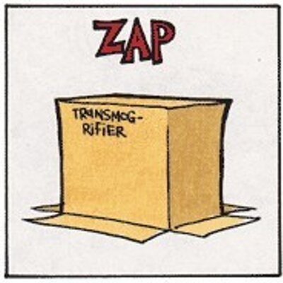
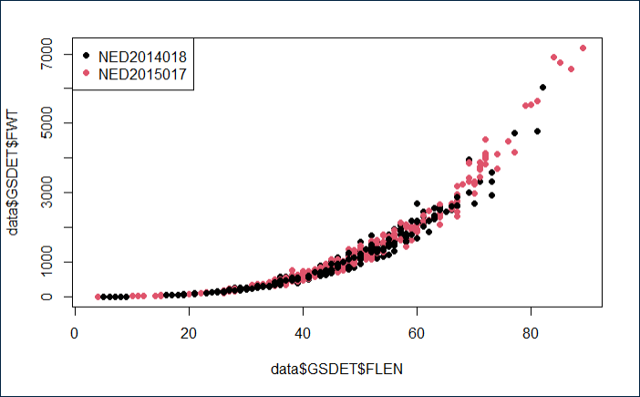
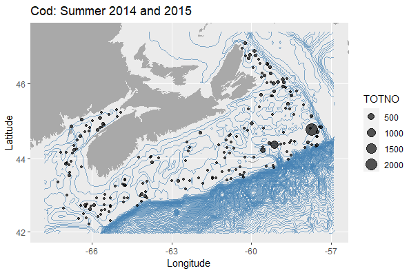
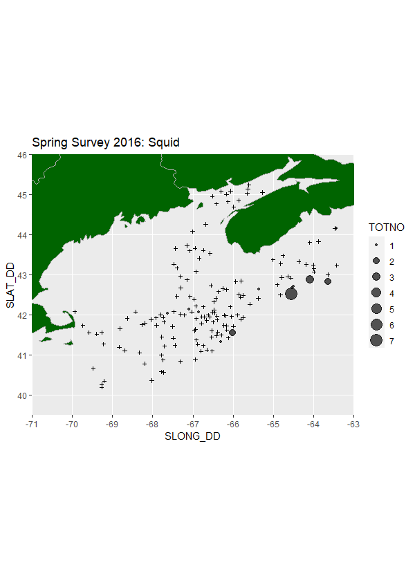

```{r load-packages, include=FALSE}
  if (!require(dplyr)) install.packages('dplyr')  
  if (!require(ggplot2)) install.packages('ggplot2') 
  # if (!require(lubridate)) install.packages('lubridate)')
  # if (!require(Mar.utils)) install.packages('Mar.utils)')
  # if (!require(tidyr)) install.packages('tidyr)')
  # if (!require(readr)) install.packages('readr')
  # if (!require(RVSurveyData)) install.packages('RVSurveyData')
  # if (!require(stats)) install.packages('stats')
  # if (!require(stringr)) install.packages('stringr)')
  if (!require(mapdata)) install.packages('mapdata')  
  # if (!require(marmap)) install.packages('marmap')  

library(dplyr)
library(ggplot2)
# library(lubridate)
# library(Mar.utils)
# library(tidyr)
# library(readr)
library(RVSurveyData)
# library(stats)
# library(stringr)
library(mapdata)
# library(marmap)

```
()[https://calvinandhobbes.fandom.com/wiki/Transmogrifier]

[**trans·mog·ri·fy**](https://www.merriam-webster.com/dictionary/transmogrify)
*verb* <font style="font-size:9pt; font-style:bold">HUMOROUS</font>

> transform in a surprising or magical manner.
>*"the cucumbers that were ultimately transmogrified into pickles"*

This package works with the [RVSurveyData package](https://github.com/PopulationEcologyDivision/RVSurveyData "an actual transmogrifier") to facilitate querying that data, and also to reformat that data as needed by different partners.

## Installation
```{r eval=FALSE}
devtools::install_github("PopulationEcologyDivision/RVTransmogrifier")
```
## extractFGP - Generating Data for Open Data Canada
Data from the RV Survey Data dataset exists on [Open Data Canada](https://open.canada.ca/data/en/dataset/8ddcaeea-b806-4958-a79f-ba9ab645f53b):

* [Summer](https://open.canada.ca/data/en/dataset/8ddcaeea-b806-4958-a79f-ba9ab645f53b/resource/dd481775-53e2-485f-ba3c-f5395d07a4a5)
* [Spring](https://open.canada.ca/data/en/dataset/8ddcaeea-b806-4958-a79f-ba9ab645f53b/resource/dd481775-53e2-485f-ba3c-f5395d07a4a5)
* [Fall](https://open.canada.ca/data/en/dataset/8ddcaeea-b806-4958-a79f-ba9ab645f53b/resource/73154215-9d65-48ba-9cc3-cdce97b81489)
* [4VSW](https://open.canada.ca/data/en/dataset/8ddcaeea-b806-4958-a79f-ba9ab645f53b/resource/2613c2f6-412e-48ce-85ae-be5bbd25d0cc)

With RVTransmogrifier, as new data becomes available, the data products provided to Open Data can now be generated virtually instantly.  The following command will build the shapefiles and csv files for the SUMMER, SPRING, FALL and 4VSW surveys for all years for which data is available for each survey (i.e. varies, but 1970+). 

```{r eval=FALSE}
extractFGP()
```
Additionally, if there is a need to generate "Open Data Canada - Style" datasets for only a subset of year(s) and/or survey(s), it can be accomplished by providing a couple parameters:
```{r eval=FALSE}
extractFGP(years = 2021, survey=c("SPRING", "SUMMER"))
```

## extractOBIS - Generating Data for OBIS Canada (in progress)
Data from the RV Survey Data dataset also exists on [OBIS](https://obis.org/):

* [Summer](http://ipt.iobis.org/obiscanada/resource?r=maritimes_summer_rv_surveys)
* [Spring](http://ipt.iobis.org/obiscanada/resource?r=maritimes_spring_rv_surveys)
* [Fall](http://ipt.iobis.org/obiscanada/resource?r=maritimes_fall_rv_surveys)
* [4VSW](http://ipt.iobis.org/obiscanada/resource?r=maritimes_4vsw_rv_surveys)

`extractOBIS()` will function virtually identically to `extractFGP()` - facilitating the creation of OBIS-compliant datasets immediately after new survey data has been QC'd.

## Querying data - propagateChanges()
This package pulls data from the [RVSurveyData package](https://github.com/PopulationEcologyDivision/RVSurveyData) into a list, and can cascade user-imposed filters performed on a single data object to all of the other related data objects.  Anyone having used the [Mar.datawrangling package](https://github.com/Maritimes/Mar.datawrangling) will find this process familiar.  

For example, if we wanted to limit the entire RV Survey data to only data associated with:
* species = cod (i.e Gadus morhua (10))
* years 2014 and 2015
* summer

We could do so via the following:
```{r eval=FALSE}
#load the package
library(RVTransmogrifier)

#load the data into an object
data <- loadRVData()

# check how many Catch records exist initially
nrow(data$GSCAT)
[1] 259818

#apply the filters above (any table can have filters applied)
data$GSMISSIONS <- data$GSMISSIONS[data$GSMISSIONS$SEASON=="SUMMER",]
data$GSMISSIONS <- data$GSMISSIONS[data$GSMISSIONS$YEAR %in% c(2014,2015),]
data$GSSPECIES_20220624  <- data$GSSPECIES_20220624[data$GSSPECIES_20220624$CODE == 10,]

#cascade the filters above to all of the data
data <- propagateChanges(data, keep_nullsets = F)

# check that filter worked
nrow(data$GSCAT)
[1] 197

```
At this point, every table within the `data` object will only hold information directly relevant to the filters we applied.  The various tables will only hold records that can be directly linked to cod caught in the summers of 2014 and 2015.  Tables that exist but were not explicitly filtered have also be filtered.  For example, even the table that holds length, weight and age information for specific fish (i.e. `GSDET`) can now be plotted, and we can be confident it will only contain cod data:

```{r eval=FALSE}
plot(data$dataLF$FLEN, data$dataLF$FWT, pch = 19, col=factor(data$dataLF$MISSION))
legend("topleft", pch = 19, legend = unique(factor(data$dataLF$MISSION)), col = unique(factor(data$GSDET$MISSION)))
```


To "reset" the data (and remove any filtering), one would just re-run `loadRVData()` and overwrite the filtered dataset.

## Plotting data - plotRV()
To facilitate plotting of the data generated by this package, `plotRV()` is provided. Continuing with the example above, to plot the cod data from the summers of 2014 and 2015, one can do:
```{r eval=FALSE}
plotRV(data, title = "Cod: Summer 2014 and 2015")
```
which generates this:



Less initially-filtered datasets can also be plotted, as species codes and aphiaids can be sent as 
parameters.  This means that a dataset can be created with a series of filters, and a loop can be 
created to generate numerous plots (e.g. one per species). 
## Getting Data for a Specific Survey
A particular survey is defined by a combination parameters, including:
  1. a range of months;
  2. a particular set of strata; and
  3. a particular tow 'type' (i.e. a "Stratified random survey set")
Because getting all of these things correct can be a little difficult, [getSurvey()](https://github.com/PopulationEcologyDivision/RVTransmogrifier/blob/main/R/getSurvey.R) is included to ensure they are applied correctly.  Following are examples for extracting the Spring 2016 survey data and the 2008 4VSW Survey data for 2005 and 2006:

```{r eval=FALSE}
spring_2016 <- getSurvey(survey = "SPRING", years = 2016)

surv_4VSW_2005_2006 <- getSurvey(survey = "4VSW", years = c(2005,2006))
```
and you were only interested in the squid from the Spring 2016 survey, you might further do
```{r eval=FALSE, include=FALSE}
# figure out code for 'Illex'
spring_2016$GSSPECIES_20220624[grepl("ILLEX",spring_2016$GSSPECIES_20220624$SPEC),]
> CODE               SPEC            COMM COMMENTS VALID_SPP   TSN APHIAID TAXON_STATUS ...
> 4511 ILLEX ILLECEBROSUS SHORT-FIN SQUID     <NA>         1 82521  153087         <NA> ...

# filter the species table to just get Illex
spring_2016$GSSPECIES_20220624 <- spring_2016$GSSPECIES_20220624[spring_2016$GSSPECIES_20220624$CODE == 4511,]

# cascade the filter above to limit all of the data to just those records related to squid.  Keep the
# nullsets so we can see where we looked, and didn't find them
spring_2016 <- propagateChanges(tblList = spring_2016, keep_nullsets = T)

```
To then plot the data, you might merge the set location information (i.e. GSINF) with the catch data 
(i.e. GSCAT) using the MISSION and SETNO fields
```{r eval=FALSE}
catches <- merge(spring_2016$GSINF, spring_2016$GSCAT, all.x=T, by=c("MISSION", "SETNO"))

ggplot() + 
   ggtitle("Spring Survey 2016: Squid")+ 
   annotation_map(map_data("world"), fill="darkgreen", colour="darkgrey")+
   geom_point(data=catches[!is.na(catches$TOTNO),], aes(SLONG_DD, SLAT_DD, size = TOTNO), alpha = 2/3)+
   geom_point(data=catches[is.na(catches$TOTNO),], aes(SLONG_DD, SLAT_DD),  shape=3, size= 1)+ 
   coord_sf(xlim = c(-71, -63), ylim = c(39.5, 46), expand = FALSE) 
```
which yields:



Note how "nullsets" are present, and displayed as "+" symbols.
### WoRMS Aphia IDs
With the addition of [WoRMS aphiaids](https://www.marinespecies.org/about.php) to the species table (i.e. GSSPECIES, it is now possible to filter data at any taxonomic level rather than just discrete species.  

For example, to generate a dataset of only data for polychaetes, one could do the following
```{r eval=FALSE}
data<-loadRVData()
data$GSSPECIES<- data$GSSPECIES[which(data$GSSPECIES$CLASS == "POLYCHAETA"),]
data <- propagateChanges(data, keep_nullsets = F)
#Review contents of data$GSSPECIES element following filtering
> unique(data$GSSPECIES$SPEC)
 [1] "EUNICIDAE F."                  "POLYCHAETA C."                 "NEPHTYS SP."                  
 [4] "NEPHTYIDAE F."                 "NEREIS SP."                    "SABELLIDAE F."                
 [7] "MALDANIDAE F."                 "PECTINARIA SP."                "POTAMILLA NEGLECTA"           
[10] "NEREIDAE F."                   "OPHELIA SP."                   "TEREBELLIDAE F."              
[13] "ARENICOLA MARINA"              "SPIONIDA F."                   "TEREBELLIDA"                  
[16] "OWENIIDAE F."                  "APHRODITA HASTATA"             "APHRODITIDAE F."              
[19] "APHRODITA ACULEATA (OBSOLETE)" "APHRODITA SP."                 "CHONE SP."                    
[22] "POLYNOIDAE F."                 "LEPIDONOTUS SQUAMATUS"         "HARMOTHOE SP."                
[25] "HARMOTHOE EXTENUATA"           "GLYCERA SP."                   "GLYCERA CAPITATA"             
[28] "HYALINOECIA CF TUBICOLA"       "LAETMONICE FILICORNIS" 

```


### Upcoming
Beyond the existing loading and filtering functions, additional functions are anticipated, including:

* simple summarization of the data
* scripts for exporting the raw data to formats such as csv
* simple geospatial visualization of the data
* scripts for exporting spatialized versions of the data (e.g. sf, shapfiles)

## Reformatting Data
The primary impetus of this package was to address the need to provide versions of this data to multiple parties. 

#### FGP/Open Data
[extractFGP.R](https://github.com/PopulationEcologyDivision/RVTransmogrifier/blob/main/R/extractFGP.R) can generate dataset associated with each of the 4 [FGP/Open data records for the Maritimes Research Vessel Surveys](https://open.canada.ca/data/en/dataset/8ddcaeea-b806-4958-a79f-ba9ab645f53b) is complete.

#### OBIS 
* coming soon (this is currently performed via discrete scripts)

#### DATRAS
* coming soon (this is currently performed via the code found [here](https://github.com/Maritimes/CanaDatras), but in the interest of consistency, that code will be edited to use this data set, rather than relying on queries of our internal database)
